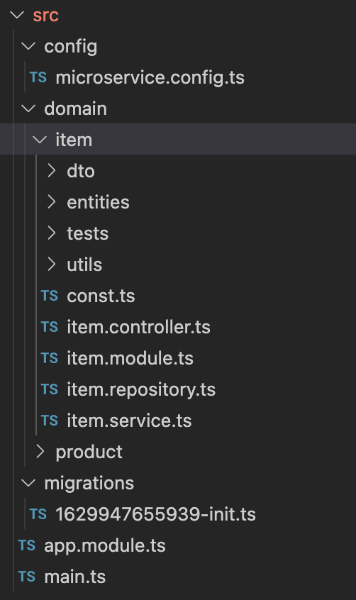

# Table of Contents
1. [Highlevel architecture](#highlevel-architecture)
2. [Workflow](#workflow)
3. [Database](#database)
4. [Framework and Folder structure](#framework-and-folder-structure)
5. [Design Pattern](#design-pattern)
6. [Get started](#get-started)

## Highlevel architecture


The tests is include 4 services:

* Inventory Command Service: Handle all commands of Inventory such as create, update, delete.
* Inventory Query Service: Handle all queries to get data from Inventory. This service will connect to the READ replica of the Command service.
* Order Service: Handle all action related to order, such as create order.
* Http API Gateway: This is public facing service with HTTP REST, and will communicate with the other 
3 services via Message Broker to GET/POST/PUT/DELETE data.
* All of these services communicate to each other via Message Broker (Redis in this case).

## Workflow

There have 2 workflows:
* Create inventory item: In order to do this, we need to make 2 separate API calls, the first one is to create 
the product and get the product id. After that use the created product id to create the Item.

* The second workflow is to create an order and preserve the product:


- First of all, the API Gateway publish message with `order.order.create` event into Message Broker with `CreateOrderDto`.
- The Order Service subcribe to this event and receive the request.
- At this point The Order Service using A Saga (Choreography) to handle the prepare and create order actions with multiple steps:
  + Prepare an order and reserve the number of products by publishing a message with `inventory.item.prepare.order` event to Message Broker.
  + The Inventory Service subscribe to this event and check if the quanity is valid. 
    > If the quantiy is valid, reduce the quantity in the database for reserving and return sucess. 
    > If the quantiy is invalid, return error.
  + The Order Service Choreography receive the response from Inventory Service for preparing the order. If:
    > All products have aivalable quantity and reserved, create the order.
    > If one of the product has invalid quantity, revert all reserved products by sending an message with `inventory.item.refund.order` to the Inventory Service to return back the reserved number of products.


## Database

* Inventory Service Database


* Order service database


## Framework and Folder structure

* The projects are using the NestJS framework.
* Folder structure: 
- Layered Architecture: The files inside folder has been classified to difference layers such as: controller, service, repository, etc ...
- Using DDD to arrange the folder and files. We have the core domain and all subdomain related to core domain. Everything related to core domain will be put into the same folder. Inside each domain folder, we have module file, controller file, service files, dto folder, repository file or repositories folder and entities folder. Besides all the constants and utilities which only use for this domain should be inside the same folder.



## Design Pattern and software development principles

* Some sofware principles are used in the projects:
  - Single Responsibility: Each class represent for separate domain and has separate responsible.
  - Open Close principle: Each class is open to extension and each function inside the class is close to modification.
  - Dependency Inversion: dependencies are injected via class constructor and by the framework.

* Some design pattern are used in the projects:
  - Saga pattern: The Order Service Orchestrator service which to handle the order transaction and execute the compensation actions when one of the steps failed.
  - Dependency injection: dependencies are injected via class constructor and by the framework.
  - CQRS: The inventory service is seperated into 2 services, the Command service handle the commands only and the query service handle the queries only.
  - Decorators pattern.
## Get started

* Prerequisite
  - Docker resource memory should be >3GB.
  - Disk Free Space: >4Gb
  - Docker latest version.

* Get started:
  - After clone the project from the github. At the root directory, run docker compose up command to start all the related stuffs.
  ```
    docker-compose up
  ```

  - Curl command to create new product:
  ```
  curl --location --request POST 'http://localhost:3000/api/inventory/products' \
  --header 'Content-Type: application/json' \
  --data-raw '{
    "name": "Asus Zenbook 16",
    "code": "AZ16",
    "color": "Black"
  }'
  ```
  - Curl command to add new item into inventory:
  ```
  curl --location --request POST 'http://localhost:3000/api/inventory/items' \
  --header 'Content-Type: application/json' \
  --data-raw '{
    "productId": "3",
    "branchId": "1",
    "price": 3000,
    "quantity": 1000
  }'
  ```
  - Curl command to get list of products:
  ```
  curl --location --request GET 'http://localhost:3000/api/inventory/products?branchId=1&color=black&orderBy=id&direction=DESC'
  ```
  - Curl command to get one product:
  ```
  curl --location --request GET 'http://localhost:3000/api/inventory/products/1'
  ```

## Unit tests

- Due to time limitation, only the Inventory Command Service has unit tests, its coverage is >80%.
## What need to be improve:
* Response structure must be standardize.
* Provide the Unit test for all of the service, at the moment, only Inventory command service has unit test.
* Move Orchestrator Service to a separate service.
* Audit log for the database activity.
* Swagger
* Parameter input validation from HTTP Request.
* Proper error response from services.
